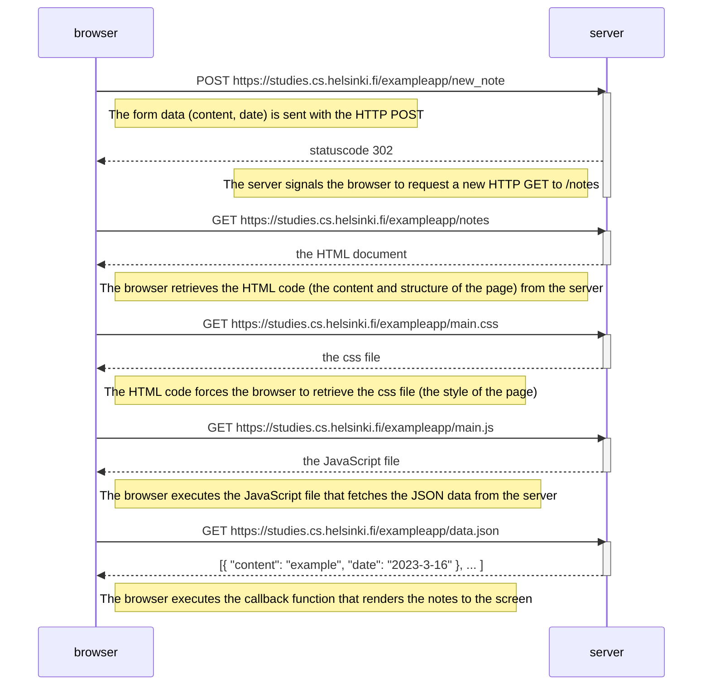

```mermaid
sequenceDiagram
  participant browser
  participant server
  
  browser->>server: POST https://studies.cs.helsinki.fi/exampleapp/new_note
  activate server
  Note right of browser: The form data (content, date) is sent with the HTTP POST
  server-->>browser: statuscode 302
  Note left of server: The server signals the browser to request a new HTTP GET to /notes
  deactivate server
  
  browser->>server: GET https://studies.cs.helsinki.fi/exampleapp/notes
  activate server
  server-->>browser: the HTML document
  deactivate server
  
  Note right of browser: The browser retrieves the HTML code (the content and structure of the page) from the server
  
  browser->>server: GET https://studies.cs.helsinki.fi/exampleapp/main.css
  activate server
  server-->>browser: the css file
  deactivate server
  
  Note right of browser: The HTML code forces the browser to retrieve the css file (the style of the page)
  
  browser->>server: GET https://studies.cs.helsinki.fi/exampleapp/main.js
  activate server
  server-->>browser: the JavaScript file
  deactivate server
  
  Note right of browser: The browser executes the JavaScript file that fetches the JSON data from the server
  
  browser->>server: GET https://studies.cs.helsinki.fi/exampleapp/data.json
  activate server
  server-->>browser: [{ "content": "example", "date": "2023-3-16" }, ... ]
  deactivate server
  
  Note right of browser: The browser executes the callback function that renders the notes to the screen
```
