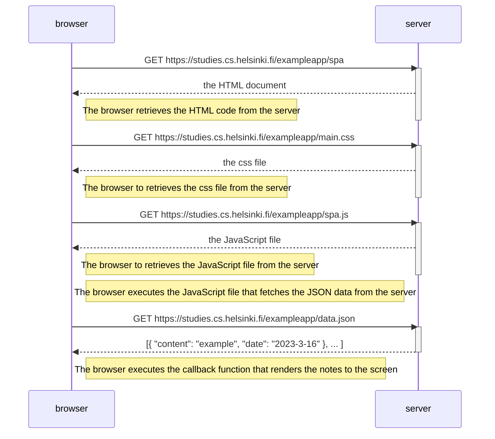

```mermaid
sequenceDiagram
  participant browser
  participant server
  
  browser->>server: GET https://studies.cs.helsinki.fi/exampleapp/spa
  activate server
  server-->>browser: the HTML document
  Note right of browser: The browser retrieves the HTML code from the server
  deactivate server
  
  browser->>server: GET https://studies.cs.helsinki.fi/exampleapp/main.css
  activate server
  server-->>browser: the css file
  Note right of browser: The browser to retrieves the css file from the server
  deactivate server
  
  browser->>server: GET https://studies.cs.helsinki.fi/exampleapp/spa.js
  activate server
  server-->>browser: the JavaScript file
  Note right of browser: The browser to retrieves the JavaScript file from the server
  deactivate server
  
  Note right of browser: The browser executes the JavaScript file that fetches the JSON data from the server
  
  browser->>server: GET https://studies.cs.helsinki.fi/exampleapp/data.json
  activate server
  server-->>browser: [{ "content": "example", "date": "2023-3-16" }, ... ]
  deactivate server
  
  Note right of browser: The browser executes the callback function that renders the notes to the screen
```
